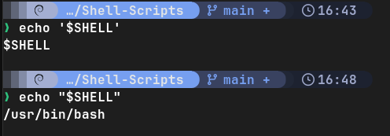
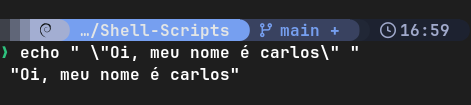
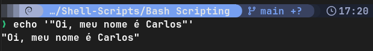
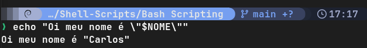
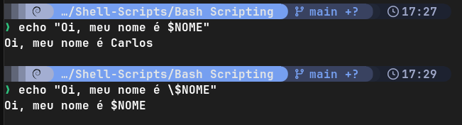

## Aspas
---
**As aspas servem para proteger uma string (texto palavras e frases etc).**

---

**Diferenças entre aspas simples (') e aspas duplas (")**

Exemplo do comando "echo" seguido da variável "$SHELL", que retorna o shell padrão do usuário.
- *Aspas simples **NÃO** reconhecem caracteres especiais* 
- *Aspas duplas **RECONHECEM** caracteres especiais* como variáveis, mas não wildcards.

---

**Encapsular aspas duplas dentro de aspas duplas**

*Se quisermos exibir um texto com aspas, utilizamos a barra invertida **antes** de cada aspa que deseja exibir.*
*Uma outra alternativa seria envelopar tudo dentro de aspas simples*

**Variáveis com aspas duplas**

*Podemos utilizar  a mesma propriedade acima mas para adicionar uma variável, tendo uma variável que retorna o resultado dentro de aspas duplas*

---

**Caracteres de escape**

*Observe que a barra invertida também pode ser utilizada para inutilizar uma variável, então a variável "$NOME" se tornou apenas texto puro*

---
